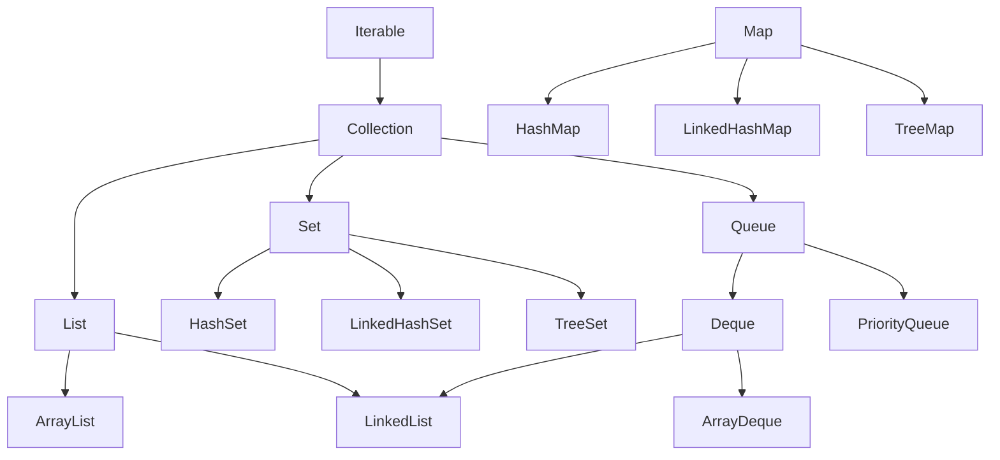

# Collection Framework

Короткий посібник до групового заняття 3.2: колекції, набори, словники, `enum`, узагальнені методи та класи.

---

## 1. Що таке колекція

**Колекція** — об'єкт, який зберігає групу інших об'єктів і вміє їх додавати, видаляти, шукати та перебирати.

| | Масив | Колекція |
|---|---|---|
| Розмір | фіксований | змінюється автоматично |
| Типи | примітиви й об'єкти | **тільки об'єкти** |
| Методи | немає (лише `length`) | `add`, `remove`, `contains`, `size`… |

Усі колекції знаходяться в пакеті `java.util`:

```java
import java.util.*;
```

---

## 2. Ієрархія



- `List`, `Set`, `Queue` — **інтерфейси**, `ArrayList`, `HashSet`… — їх **реалізації**.
- `Map` **не** наслідує `Collection`, але входить до Collection Framework.

| Інтерфейс | Порядок | Дублікати | Доступ |
|---|---|---|---|
| `List` | зберігається | так | за індексом |
| `Set` | залежить від реалізації | **ні** | немає індексу |
| `Queue` / `Deque` | черга / стек | так | з початку / кінця |
| `Map` | залежить від реалізації | ключі — ні, значення — так | за ключем |

**Правило:** тип змінної — інтерфейс, після `new` — реалізація.

```java
List<String> names = new ArrayList<>();
Map<String, Integer> ages = new HashMap<>();
```

---

## 3. Обгортки та автоупаковка

Колекції не зберігають `int`, `double`, `char` — лише класи-обгортки.

| Примітив | Обгортка |
|---|---|
| `int` | `Integer` |
| `double` | `Double` |
| `char` | `Character` |
| `boolean` | `Boolean` |

```java
List<Integer> nums = new ArrayList<>();
nums.add(5);          // автоупаковка: int -> Integer
int x = nums.get(0);  // автоматичне розпакування: Integer -> int
```

> ⚠️ `nums.remove(1)` видаляє елемент **з індексом 1**, а `nums.remove(Integer.valueOf(1))` — **значення 1**.

---

## 4. List — список

| Метод | Дія |
|---|---|
| `add(e)` / `add(i, e)` | додати в кінець / на позицію `i` |
| `get(i)` | отримати елемент |
| `set(i, e)` | замінити елемент |
| `remove(i)` / `remove(o)` | видалити за індексом / за значенням |
| `size()` | кількість елементів |
| `contains(o)` | чи є елемент |
| `indexOf(o)` | індекс або `-1` |
| `isEmpty()` / `clear()` | чи порожній / очистити |

### ArrayList vs LinkedList

| | `ArrayList` | `LinkedList` |
|---|---|---|
| Будова | динамічний масив | двозв'язний список |
| `get(i)` | швидко | повільно (прохід по вузлах) |
| Вставка / видалення на початку | повільно (зсув елементів) | швидко |
| Коли брати | **майже завжди** | часті операції з початком/кінцем |

Додаткові методи `LinkedList`: `addFirst`, `addLast`, `getFirst`, `getLast`, `removeFirst`, `removeLast`.

---

## 5. Перебір колекцій

```java
for (int i = 0; i < list.size(); i++) { ... list.get(i) ... }  // за індексом (тільки List)

for (String s : list) { ... }                                    // for-each (будь-яка колекція)

Iterator<String> it = list.iterator();                           // ітератор
while (it.hasNext()) {
    String s = it.next();
    if (s.isEmpty()) it.remove();                                // безпечне видалення
}
```

> ⚠️ Видаляти елементи **всередині for-each** не можна — буде `ConcurrentModificationException`. Використовуйте `Iterator.remove()`.

---

## 6. Set — набір (множина)

Зберігає лише **унікальні** елементи. `add` повертає `false`, якщо такий елемент уже є.

| Реалізація | Порядок | Вимога до елементів |
|---|---|---|
| `HashSet` | не гарантований | `equals()` + `hashCode()` |
| `LinkedHashSet` | порядок додавання | `equals()` + `hashCode()` |
| `TreeSet` | відсортований | `Comparable` або `Comparator` |

Корисні методи `TreeSet`: `first()`, `last()`, `headSet(e)`, `tailSet(e)`.

Операції над множинами:

```java
a.addAll(b);     // об'єднання
a.retainAll(b);  // перетин
a.removeAll(b);  // різниця
```

---

## 7. Map — словник (ключ → значення)

| Метод | Дія |
|---|---|
| `put(k, v)` | додати / замінити значення |
| `get(k)` | значення або `null` |
| `getOrDefault(k, d)` | значення або `d` |
| `containsKey(k)` / `containsValue(v)` | чи є ключ / значення |
| `remove(k)` | видалити пару |
| `putIfAbsent(k, v)` | додати, якщо ключа немає |
| `keySet()` / `values()` / `entrySet()` | ключі / значення / пари |

| Реалізація | Порядок ключів |
|---|---|
| `HashMap` | не гарантований |
| `LinkedHashMap` | порядок додавання |
| `TreeMap` | відсортований |

Перебір:

```java
for (Map.Entry<String, Integer> e : map.entrySet()) {
    System.out.println(e.getKey() + " = " + e.getValue());
}
```

---

## 8. Queue і Deque — черга та стек

| Структура | Принцип | Методи |
|---|---|---|
| Черга (`Queue`) | FIFO — перший прийшов, перший вийшов | `offer`, `poll`, `peek` |
| Стек (`Deque`) | LIFO — останній прийшов, перший вийшов | `push`, `pop`, `peek` |
| `PriorityQueue` | першим виходить «найменший» | `offer`, `poll`, `peek` |

Для черги і стека рекомендовано `ArrayDeque` (клас `Stack` застарів).

---

## 9. equals, hashCode, Comparable

**`equals()` + `hashCode()`** — потрібні, щоб `HashSet` і `HashMap` розуміли, що два **різні об'єкти** з однаковими полями — це **той самий** елемент.

> Якщо `a.equals(b)` → `true`, то `a.hashCode() == b.hashCode()` **обов'язково**.

```java
@Override
public boolean equals(Object o) {
    if (this == o) return true;
    if (!(o instanceof Point)) return false;
    Point p = (Point) o;
    return x == p.x && y == p.y;
}

@Override
public int hashCode() {
    return Objects.hash(x, y);
}
```

**`Comparable<T>`** — «природний» порядок об'єктів. Потрібен для `TreeSet`, `TreeMap`, `PriorityQueue`, `Collections.sort()`.

```java
class Cadet implements Comparable<Cadet> {
    public int compareTo(Cadet other) {
        return this.name.compareTo(other.name);  // <0, 0, >0
    }
}
```

**`Comparator<T>`** — окремий клас з методом `compare(a, b)`, коли потрібен **інший** порядок сортування.

---

## 10. Клас Collections

| Метод | Дія |
|---|---|
| `Collections.sort(list)` | сортування |
| `Collections.reverse(list)` | розвернути |
| `Collections.shuffle(list)` | перемішати |
| `Collections.max(c)` / `min(c)` | максимум / мінімум |
| `Collections.frequency(c, o)` | скільки разів зустрічається |
| `Collections.unmodifiableList(list)` | список лише для читання |

> `List.of(...)`, `Set.of(...)`, `Map.of(...)` створюють **незмінні** колекції — `add` кине `UnsupportedOperationException`.

---

## 11. Тип enum

**Перерахування** — тип з фіксованим набором констант.

```java
enum Rank { PRIVATE, SERGEANT, LIEUTENANT, CAPTAIN }
```

| Метод | Дія |
|---|---|
| `Rank.values()` | масив усіх констант |
| `Rank.valueOf("CAPTAIN")` | константа за назвою |
| `r.name()` | назва константи |
| `r.ordinal()` | порядковий номер (з 0) |

Enum може мати **поля, конструктор і методи** (конструктор завжди `private`):

```java
enum Rank {
    PRIVATE("Солдат"), CAPTAIN("Капітан");

    private final String title;
    Rank(String title) { this.title = title; }
    public String getTitle() { return title; }
}
```

- Порівняння: `r == Rank.CAPTAIN` (через `==`, не `equals`).
- Можна використовувати у `switch`.
- Спеціальні колекції: `EnumMap`, `EnumSet`.

---

## 12. Узагальнення (Generics)

Параметр типу `<T>` дозволяє писати один код для різних типів і перевіряти типи **під час компіляції**.

### Узагальнений клас

```java
class Box<T> {
    private T value;
    public void set(T value) { this.value = value; }
    public T get() { return value; }
}

Box<String> b = new Box<>();
```

### Узагальнений метод

```java
static <T> void printAll(List<T> list) {
    for (T item : list) System.out.println(item);
}
```

### Обмеження типу

```java
static <T extends Comparable<T>> T max(List<T> list) { ... }
```

`T extends Comparable<T>` — підходить лише тип, який вміє порівнюватися.

### Позначення

| Літера | Значення |
|---|---|
| `T` | Type — тип |
| `E` | Element — елемент колекції |
| `K`, `V` | Key, Value — ключ і значення |

### Wildcard `?`

| Запис | Значення |
|---|---|
| `List<?>` | список будь-якого типу |
| `List<? extends Number>` | `Number` або нащадки — **читати** |
| `List<? super Integer>` | `Integer` або предки — **записувати** |

> ⚠️ `List<Integer>` **не є** підтипом `List<Number>` (інваріантність).

---

## 13. Type erasure та Raw types

- **Type erasure** — після компіляції параметри типу «стираються» (`List<String>` → `List`), тому `new T()` і `T[]` створити не можна.
- **Raw types** — `List list = new ArrayList();` без `<...>`: компілятор не перевіряє типи, помилка вилетить лише під час виконання (`ClassCastException`). Не використовуйте.

---

## 14. Яку колекцію обрати?

| Задача | Колекція |
|---|---|
| Список з доступом за індексом | `ArrayList` |
| Часто додавати / видаляти з початку | `LinkedList`, `ArrayDeque` |
| Лише унікальні значення | `HashSet` |
| Унікальні та відсортовані | `TreeSet` |
| Пошук за ключем | `HashMap` |
| Відсортовані ключі | `TreeMap` |
| Порядок додавання важливий | `LinkedHashSet`, `LinkedHashMap` |
| Черга / стек | `ArrayDeque` |
| Обробка за пріоритетом | `PriorityQueue` |
| Ключі — константи enum | `EnumMap` |
